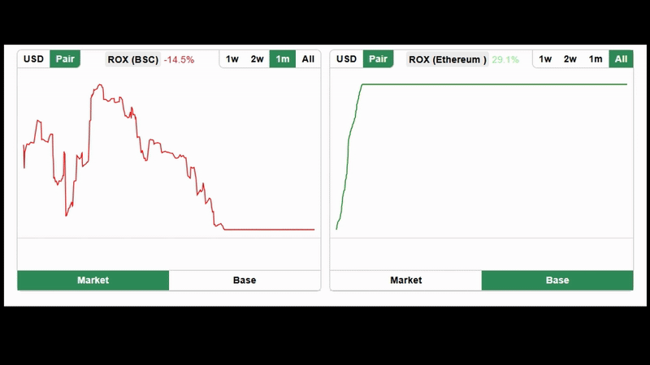

# Blockchain Token Price Graph (2021)

This code is from my 2021 work on a token investment website where i wrote a price graph generator code that took data from the local price entries that we used to keep track of inside our db, and generate multiple versions of SVG graphs with a cronjob multiple times a day and save them in a tokens table to display interactive token price graphs with different time filters.

## Warning
This code is only useful in that very specific case when you log token prices in your own database

I recently rewrote some of the the laravel code into pure PHP to make it modular just for the sake of it. All the data inside those tables are from 2021-2022 so a lot of filters will show (NO DATA AVAILABLE) or show incorrect old data.

## Demo


## Test Run (On XAMPP)

1. Create database named "sdtoken" (you can change it inside config/index.php if you don't want this name)
2. Import 4 tables from the sql folder
3. Visit index.php


## How to use

1. Include the CSS and JS:
```html
<link rel="stylesheet" href="css/UznaTokenGraph.css">
<script src="js/UznaTokenGraph.js"></script>
```

2. Initialize the graph
```js
let graph = new TokenGraph({
  name: "Token Name",
  tokenId: 1,
  container: document.querySelector('.token-graph-renderer'),
  url: "example_backend.php"
});
```

3. Small example inside example_backend.php
```php
<?php
header('Content-Type: application/json; charset=utf-8');
include "config/index.php";
include "UznaTokenGraph.php";

if($_POST['time']){
    $svg = UznaTokenGraph::getSvgFromRequest($_POST);
    echo json_encode([
        'success' => true,
        'data' => $svg
    ]);
}
```